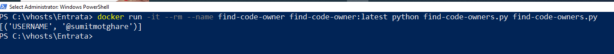

# Find Code Owner

This is a small utility to find code owners for the given file path.

> **Note**: To run the Utility, you must have a valid Codeowners file.

## Getting started

```sh
git clone git@github.com:sumitmotghare/find-code-owner.git && cd $(basename $_ .git)
```

## Setup - Copy the required CODEOWNERS file into this directory location

```sh
cp ../<Source-Repository-Path>/CODEOWNERS .
```

> **Note**: Make sure to have the code owners filename in all CAPS.

## Build the Container Image

```sh
docker build . -t find-code-onwer
```

## Running

You will not need a running container hence we just need to execute this command:

```sh
docker run -it --rm --name find-code-owner find-code-owner:latest python find-code-owners.py <Path for the file for which you need a code owner>
```

### Example
```sh
docker run -it --rm --name find-code-owner find-code-owner:latest python find-code-owners.py find-code-owners.py
```

